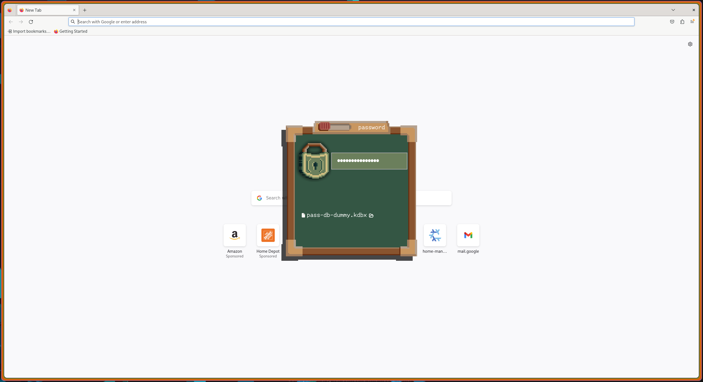
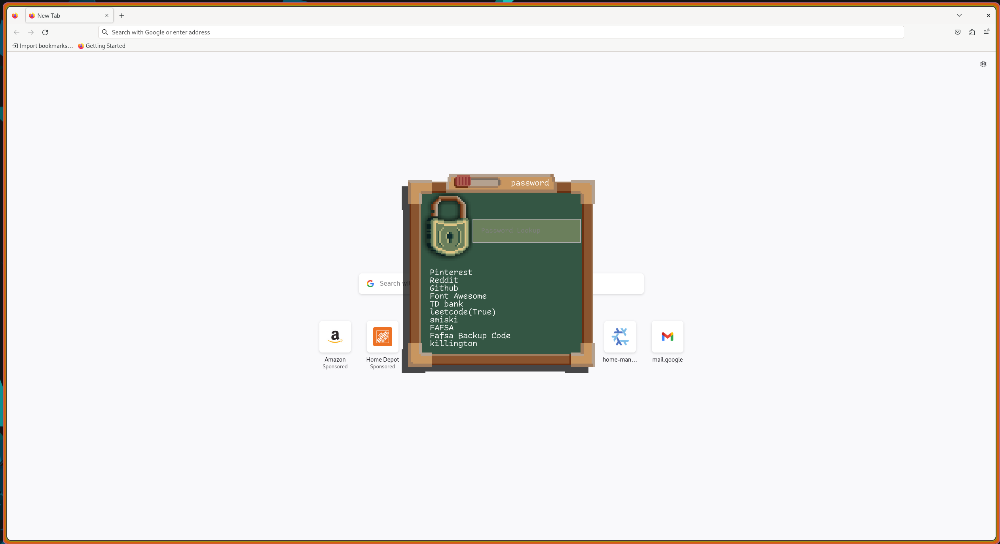
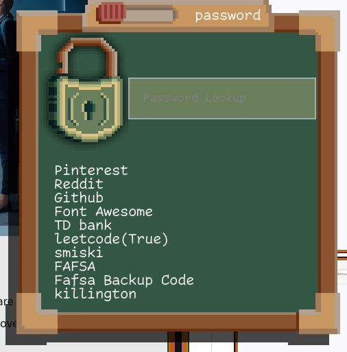

# Table of Contents

1.  [Password Widget](#org97a38c4)
2.  [Description](#org70c9d72)
3.  [Screenshots](#org1892f74)
4.  [Installation](#org10a5bb0)
    1.  [My hyprland setup](#org2a71483)
    2.  [Non nixos setup](#orgde5bf47)
5.  [Usage](#org4351af2)
6.  [Features](#orgfeb4274)
7.  [Contributing](#org3d339bd)

# Password Widget

# Description

This project is essentially a wrapper around KeepassXC. It uses the keepassxc-cli to interact with password database files. I had been using KeepassXC, but it was cumbersome to open the application, select the password, and manually copy it using Ctrl+C. My solution is a much faster, mouseless interface.

Unfortunately, the UI is not easily customizable since I opted for a highly stylized pixel art approach, which doesn’t lend itself to easy color customization. To create the UI, I used AGS.

This project is essentially a wrapper around [Keepassxc](https://keepassxc.org/).  It uses the [keepassxc-cli](https://manpages.ubuntu.com/manpages/focal/man1/keepassxc-cli.1.html) to interact with the password database files.  I had been using [Keepassxc](https://keepassxc.org/) however it was cumbersome to opent the application, select the password, and manually copy it using Ctrl+C. My solution is a much faster, mouseless interface.

I went for a very stylized approach with pixel art which came out pretty good.  To actually create the UI I used [AGS](https://github.com/Aylur/ags).  

# Screenshots

# Installation

if your using nix then its super easy, just add it as in input and put the derivation in your packages

    
    {
      description = "demo flake";
    
      inputs = {
        nixpkgs.url = "github:NixOS/nixpkgs/nixpkgs-unstable";
        flake-utils.url = "github:numtide/flake-utils";
    
        pix_pass = {
          url = "github:k-kahora/keepassxc-widget";
        };
      };
    
      outputs = { self, nixpkgs, flake-utils, pix_pass}:
        flake-utils.lib.eachDefaultSystem (system:
          let
            pkgs = nixpkgs.legacyPackages.${system};
            lib = pkgs.lib;
            pix_pass_pkg = pix_pass.packages.${system}."default";
          in
          {
            devShells.default = pkgs.mkShell {
              packages = [
                  pix_pass_pkg
              ];
            };
          }
        );
    }

Then just run 

    
    nix develop
    
    pass-launcher open
    
    # to toggle the visablity
    pass-launcher toggle

## My hyprland setup

    # On start I run pass-launcher open in the background
    
    bind = $mainMod, P, exec, pass-launcher toggle

## Non nixos setup

Dependecies

-   keepassxc
-   ags
-   libsecret (secret-tool)

clone the project and just run `ags -c ./config.js`

# Usage

Open up an existing keepassxc database file and enter your password to begin browsing the available passwords.  Hitting enter on one

# Features

-   [X] Open any database file on your system
-   [X] Toggle between username and password
-   [X] Enter groups and leave groups
-   [X] C-g to toggle password or username
-   [X] C-r to reset the database search
-   [X] Click on lock to lock database file
-   [X] Reads the `KEEPASSXC_BD` env variable so you do not have to use file selector

# Contributing

Contributions are what make the open source community such an amazing place to learn, inspire, and create. Any contributions you make are ****greatly appreciated****.

If you have a suggestion that would make this better, please fork the repo and create a pull request. You can also simply open an issue with the tag "enhancement".
Don't forget to give the project a star! Thanks again!

1.  Fork the Project
2.  Create your Feature Branch (\`git checkout -b feature/AmazingFeature\`)
3.  Commit your Changes (\`git commit -m 'Add some AmazingFeature'\`)
4.  Push to the Branch (\`git push origin feature/AmazingFeature\`)
5.  Open a Pull Request

